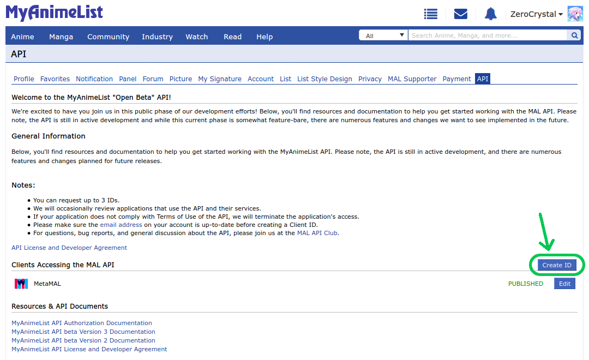

# MyAnimeList Setup Guide

This document guides you through setting up the MyAnimeList API which is used extensively in this project, ranging from OAuth2 login to accessing public information likes anime genres and ratings.

The content is straight-up taken from [this awesome blog post](https://myanimelist.net/blog.php?eid=835707), with slight modifications. Thank you, [ZeroCrystal](https://myanimelist.net/profile/ZeroCrystal).

### Register your application

API access is restricted to the owners of a MAL Client ID. You can create your application by clicking here or opening Account Settings → API → Create ID.

Here you will be able to get your personal Client ID and, optionally, a Client Secret. The Client Secret must be kept somewhere safe! Anyone who can access it may issue privileged commands on behalf of your application.

> Note: You need to add these obtained Client ID and Client Secret to the `credentials.env` file as mentioned in the [README](./README.md).

The application form contains several mandatory fields. I'll focus on some of them:

- **App Type** ⁓ You have four choices: "Web", "Android", "iOS", and "Other", but they can be split into two functional categories: private API clients ("Web"), and public API clients ("Android", "iOS", and "Other").

	A private API client is meant as a piece of software that can safely store a Client Secret in a place unreachable by a regular user. Ordinarily, this condition can only be satisfied by setting up a web server, hence the "Web" app type.

	In contrast, public API clients cannot store a secret due to their architecture, so they don't receive one. Typically, this is the case of applications running their entire codebase on a user's device, like mobile or native apps, or browser's userscripts.

	Both public and private clients can interact with the API in the exact same way, the only difference is how a user is authenticated. The App Type of an application cannot be changed in the future.

- **App Redirect URL** ⁓ This parameter will be explained later. For now, you can set it to `http://localhost:5000/callback/myanimelist`. You will be able to change it any time you want.

- **Homepage URL** ⁓ The URL of a webpage which is linked to your API application. If you don't have one, you can set it to your MAL's profile URL. This can be changed in the future.

- **Name / Company Name** ⁓ You can set this field in the same way as App Name.

Note that these suggestions are valid only for non-commercial applications. If you're running a business or making a profit thanks to the API, then you must fill each field properly.
